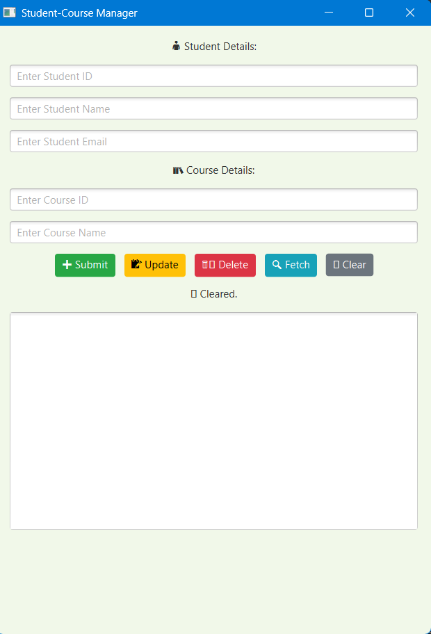

# 📚 Student-Course Management App

This is a **JavaFX + MySQL** desktop application that allows you to **Insert, Update, Delete, and Fetch** student and course details using a simple graphical user interface.

---

## 🔧 Tech Stack

- 💻 Java (JDK 11+)
- 🎨 JavaFX for GUI
- 🗃️ MySQL Database
- 🔌 JDBC (Java Database Connectivity)

---

## 💻 Features

- ➕ Insert new students and courses
- 📝 Update existing records
- 🗑️ Delete with confirmation
- 🔍 Fetch and display records from all tables
- 🧹 Clear inputs and output
- 🎯 Clean, simple, and beginner-friendly

---

## 📋 Database Setup

Database Name: `stdinfo`

```sql
CREATE TABLE students (
  student_id INT PRIMARY KEY,
  name VARCHAR(100),
  email VARCHAR(100)
);

CREATE TABLE courses (
  course_id INT PRIMARY KEY,
  name VARCHAR(100)
);

CREATE TABLE enrollments (
  student_id INT,
  course_id INT,
  FOREIGN KEY (student_id) REFERENCES students(student_id),
  FOREIGN KEY (course_id) REFERENCES courses(course_id)
);
```

---

## 🚀 How to Run

### 1. Prerequisites

- Java JDK (11 or higher)
- JavaFX SDK
- MySQL Server
- MySQL JDBC Connector

### 2. Configure the Database

- Create a MySQL database named `stdinfo`
- Run the SQL code above to create the tables
- Replace the connection credentials in your Java code:

```java
Connection con = DriverManager.getConnection(
  "jdbc:mysql://localhost:3306/stdinfo", "your_username", "your_password");
```

### 3. JavaFX Setup (Eclipse / IntelliJ)

**VM Options to add:**

```
--module-path "path_to_javafx_lib" --add-modules javafx.controls,javafx.fxml
```

Example:  
If JavaFX SDK is in `C:\javafx-sdk-21\lib`, VM options will be:

```
--module-path "C:\javafx-sdk-21\lib" --add-modules javafx.controls,javafx.fxml
```

Also add `javafx-sdk/lib` to your build path or libraries.

### 4. Run the App

- Open `FXDatabaseInsert.java`
- Right-click → Run as → JavaFX Application


---

## 📸 Application UI Preview




---

Create a folder called `Screenshot.png` and add UI images there if needed.

---

## 📂 Project Structure

```
StudentCourseApp/
├── src/
│   └── FXDatabaseInsert.java
├── README.md
└── screenshots/     ← (optional)
```

---

## 🧠 What You'll Learn

- JavaFX UI Design
- JDBC + SQL Integration
- Exception Handling
- GUI-based CRUD Operations
- Project Structure & Clean Code

---

## ✅ Interview Points

- Clean and understandable code
- Used `PreparedStatement` to avoid SQL injection
- Confirmation before delete
- Exception messages shown clearly
- Every part is student-friendly and explainable

---

## 🔮 Future Ideas

- Use `ComboBox` for selecting IDs
- Auto-generate IDs (MySQL AUTO_INCREMENT)
- Add login system
- Export data to CSV
- Search/filter functionality

## 👨‍🎓 Author

Made by **Devisetty Rohith** 👨‍💻  
B.Tech Student | Learning Java & Databases | Built this for practical learning and interview preparation.


## 📬 Contact

Need help or want to show your project?  
Message me or connect via GitHub!# student-management
